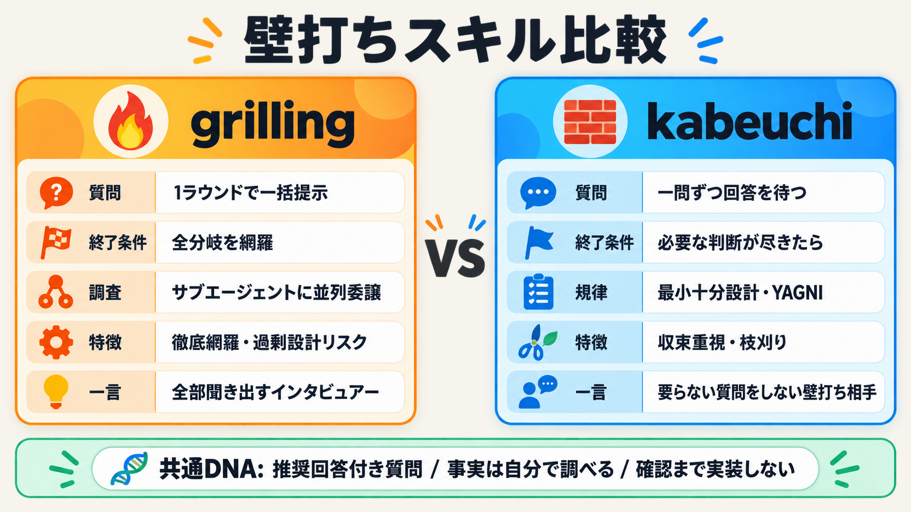

# kabeuchi 設計メモ: grilling との比較と進化の方向性

- ステータス: 設計メモ(未実装の提案を含む)
- 日付: 2026-08-29
- 対象: `kabeuchi/SKILL.md`

kabeuchi の改善検討のために、派生元である mattpocock の grilling 系スキルとの比較、
grilling ベースで観測された過剰設計の構造的分析、サブエージェント調査の移植案をまとめる。

## 系譜

```text
mattpocock/skills 始祖 grill-me (2026-04, 英語・一問ずつ)
        │
        ├─ mattpocock 系: 2026-07-16 に「frontier 一括ラウンド制」へ大改訂 → 現在の grilling
        │
        └─ u7chan 系: old-agent-skills の grilling (日本語化・拡張)
                → リポ引っ越し → kabeuchi に改名・収束特化へ拡張
```

同じ始祖から、mattpocock は「速度(一括)」へ、kabeuchi は「収束(最小化)」へ別方向に進化した。

始祖 grill-me の本体(要約):

> Interview me relentlessly about every aspect of this plan until we reach a shared
> understanding. Walk down each branch of the design tree, resolving dependencies
> between decisions one-by-one. For each question, provide your recommended answer.
> Ask the questions one at a time.
> If a question can be answered by exploring the codebase, explore the codebase instead.

<details>
<summary>日本語訳(参考)</summary>

> この計画のあらゆる側面について、共通理解に到達するまで私を徹底的に質問してください。
> design tree の各分岐を辿り、判断間の依存関係を一つずつ解決してください。
> 各質問には、あなたの推奨回答を添えてください。
> 質問は一度に一つだけ尋ねてください。
> コードベースを探索すれば答えられる質問は、ユーザーに尋ねずにコードベースを探索してください。

</details>

## 比較表

| 観点 | 始祖 grill-me (英語) | 最新 grilling (mattpocock, 2026-08-29 時点) | 元 grilling (old-agent-skills) | 現行 kabeuchi |
|---|---|---|---|---|
| 質問の進め方 | 一問ずつ | 1 ラウンド=frontier(前提が揃った質問全部)を一括提示し回答を待つ | 一問ずつ | 一問ずつ |
| 設計の捉え方 | design tree を分岐ごとに | design tree + frontier 再計算を明示概念化 | 依存関係を上流から解決 | Goal/Done 起点で必要な判断だけ依存順に |
| 質問フォーマット | 指定なし | `❓ Q1 - **タイトル**` + 本文 + `➡️ 推奨` + `---` 区切り | `質問{No}` + 選択肢 + `(推奨💡)` | 同様のテンプレ + 選択肢の実装スコープ差を明記 |
| 推奨回答 | あり | あり(➡️行で単独提示) | あり(理由付き) | あり(理由+スコープ影響付き) |
| 事実調査 | コードベースで自分で調べる | サブエージェントに非同期委譲(ラウンドをブロックしない) | 自分で調査(ユーザーに尋ねない) | 自分で調査(ユーザーに尋ねない) |
| ハーネス依存 | なし(汎用プロンプトのみ) | あり(sub-agent 委譲が Claude Code 前提、非対応では同期的調査に劣化) | なし(本体で調査) | なし(本体で調査) |
| 終了条件 | 共通理解到達まで(暗黙) | frontier が空になること(黙示された前提ゼロ) | 重要な未解決事項がなくなるまで | Done 判定に必要な判断が尽きたら即終了 |
| スコープ制御 | なし | なし(木を網羅が主義) | 対象外領域の記載のみ | 最も厚い: 最小十分設計、YAGNI、不可逆判断の優先、スコープ拡大の検知 |
| フレーミング | なし | なし | 目的・成功条件の把握 | Goal/Done/Constraints/Non-goals を最初に確定 |
| 最終サマリ | なし | なし(確認ゲートのみ) | 決定事項・前提・残り不確実性 | Goal/Done/In scope/Non-goals/Decisions/Deferred/Risks |
| 実装抑制ゲート | なし | あり(ユーザー確認まで行動しない) | あり | あり(確認後も実行は別依頼で待つ) |
| 言語対応 | 英語固定 | 英語(絵文字固定) | 日本語テンプレ固定 | 会話言語に追従する規定 |
| 自動起動 | `disable-model-invocation: true` | "grill" トリガーで自動起動 | トリガーフレーズで自動起動 | 同左 + "kabeuchi" トリガー |

主要な差分の要約: **grilling は「全部聞き出すインタビュアー」、kabeuchi は「要らない質問をしない壁打ち相手」**。

始祖由来の共通 DNA(全バージョンで継承):

1. 事実は自分で調べる / 決定はユーザーに委ねる分離
2. 推奨回答の添付
3. 依存関係は上流から下流へ解決
4. 確認ゲートまで実装しない

## grilling ベースの過剰設計問題

grilling を壁打ち相手として使うと、モデルによっては過剰設計に振れる。構造的な理由は 3 つ:

1. **終了条件が「網羅」であって「十分」ではない**
   grilling のゴールは frontier が空になること(黙示された前提ゼロ)。掘れば掘るほど成功するスキルであり、
   「この分岐は決めなくていい」という刈り込み基準が存在しない。
   kabeuchi は `Would omitting this prevent the agreed completion evidence from being satisfied?`
   という枝刈りテストがあり、終了条件が Done に紐づく。ここが本質的な違い。
2. **「選択肢+推奨」フォーマットの推奨バイアス**
   LLM は推奨を求められると「より堅牢で拡張性のある方」を選びがちで、選択肢を 3 つ作らせる仕様自体が
   設計空間を広げる。kabeuchi は `Recommend the simplest option that satisfies the current requirements`
   と推奨の方向を simple 側へ固定して対抗している。
3. **frontier 一括提示が「決めるべきことの総量」を増やす**
   1 ラウンドで全部見せるのは速度的に優秀だが、質問の数=設計の複雑さの知覚を膨らませ、
   回答による tree 再形成で frontier が広がる方向に働きやすい。kabeuchi には
   `If an answer expands the agreed scope, call out the scope increase` という検知規則があるが、
   grilling にはスコープ拡大の警報がない。

| | 原因となる失敗モード | 補正方向 |
|---|---|---|
| grilling | エージェントが聞かずに作り始める | 聞く方向へ強く押す → 徹底モデルでは過剰設計に振れる |
| kabeuchi | エージェントが盛りすぎる | 刈り込み方向へ押す → 息の漏れたモデルでは聞き足りない可能性 |

どちらも corrective lens であり、装着するモデルの素性によって効き目が変わる。

## サブエージェント調査のハーネス依存性

最新 grilling の「サブエージェントに事実調査を委譲し、ラウンドをブロックしない」は有用だが、
機構の記述が Claude Code 前提(背景 Task/subagent)であり、ハーネスが非対応の場合は
同期的な調査にフォールバックしてノンブロッキング性が失われる。

移植すべきは機構ではなく**ノンブロッキングの待ち合わせ規約**:

> 調査中も残りの frontier は質問してよく、調査の下流の質問だけが待つ

機構は能力検出に置き、段階的フォールバックを設計に含める(progressive enhancement):

| ティア | 機構 | 動作 |
|---|---|---|
| 1 | バックグラウンド委譲あり(Claude Code の Task、pi なら Herdr 別ペイン等) | 調査を投げつつ質問を続行し、下流質問だけ保留 |
| 2 | 並列ツール呼び出しのみ(同一コンテキスト) | 質問の合間に調査をバッチ実行。質問の最中にユーザーを待たせない |
| 3 | 逐次のみ | 「この質問は調査が必要なので保留」を明示してキュー化し、答えられる質問を先に処理 |

サブエージェント化の副次的な効用は並列性より**コンテキスト汚染の遮断**が大きい。
kabeuchi は一問ずつ・長時間セッションになりがちで、調査ノイズが main(本体エージェント)の会話に蓄積すると
後半の質問品質が落ちる。委譲すると蒸留された事実だけが main に返る。

### 委譲に固有の失敗モード: サブエージェントの「事実」は汚染されうる

委譲すると「事実」の出所がモデルの報告になり、誤った事実が下流の決定を確定させうる。
対策として「返ってくる事実には file:line やコマンド出力の根拠を必須にする。
根拠なき事実は仮説として扱う」条項をセットで入れる。

### トレードオフの整理

| 得られるもの | 失うもの・リスク |
|---|---|
| 並列性 — 調査を待たずに質問を進められる | 事実の信頼性 — 目で見ていない根拠で決定が進む |
| コンテキストの清浄さ — 後半も質問品質が落ちない | 間接知 — コードベースの手触りを本体が吸収しない |
| スケール — 複雑なプロジェクトでも破綻しない | オーバーヘッド — 調査依頼のプロンプト作成コスト |

線引きの目安:

- **委譲向き**: 広範囲で機械的な調査(設定の参照箇所、API 一覧、依存関係の洗い出し)＝ file:line で検証しやすいもの
- **本体で見る向き**: 決定の核になる微妙な判断材料(既存設計の意図、アーキテクチャの空気感)＝蒸留すると質が落ちるもの

## 移植方針(未実装の提案)

kabeuchi に Fact-finding セクションを足す場合の要点:

1. frontier の構築条件を「前提が揃った質問」ではなく「前提が揃っていて、**答えが Done を変える質問**」に絞る
2. どの質問にも `Defer` を第一級の回答として許可する(答えない決定を決定として扱う)
3. 推奨は常に「現在の要件を満たす最単純案」から提示し、複雑な案を推すなら複雑性の正当化を義務づける
4. 事実調査はティア分けフォールバックで記述し、特定ハーネスの機構名に依存しない
5. 事実には file:line 等の根拠を必須にし、根拠なき事実は仮説として扱う

## 参考画像



<details>
<summary>Generated by 🎨 gpt-image-2</summary>

- 生成: pi の `codex_generate_image`(backend は OpenAI `gpt-image-2`)。Codex モデル `gpt-5.5` が画像生成ツールを起動
- 委譲: Herdr 別ペインで起動した pi(`--provider openai-codex --model gpt-5.6-luna --thinking max`)に依頼して生成

</details>

## 参照

- 最新 grilling(2026-08-29 時点): <https://github.com/mattpocock/skills/blob/main/skills/productivity/grilling/SKILL.md>
- 始祖 grill-me(初版コミット 62f43a1): <https://github.com/mattpocock/skills/blob/62f43a18177be6ec82da242e59ffbc490a4c22ea/skills/productivity/grill-me/SKILL.md>
- 現在の grill-me は grilling 呼び出しのスタブ(2026-08-29 時点)
- 元 grilling(old-agent-skills): <https://github.com/u7chan/old-agent-skills/blob/main/skills/design/grilling/SKILL.md>
- kabeuchi: [../kabeuchi/SKILL.md](../kabeuchi/SKILL.md)
